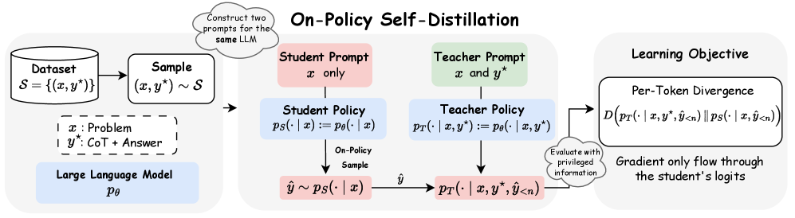
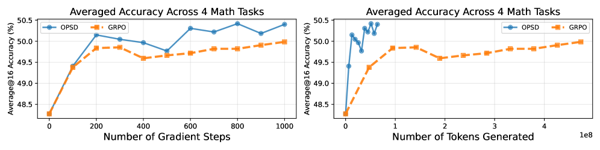

<!-- _class: lead -->
# OPSD論文読み
# Self-Distilled Reasoner

On-Policy Self-Distillation for LLMs

  

---
# On-Policy Self-Distillation 

- OPSDは「同一モデル」を teacher/student に分ける（条件付けが違う）
- 正解付き推論データの参照解 $y^*$ を teacher 側に入れ、token-level に密な信号でDivergence最小化
-  Qwen4B/8Bのmath実験では GRPO と同等以上、かつ token efficient

---
# 背景：なぜOPSDが欲しい？

- **SFT**: off-policy で distribution mismatch が起きやすい
- **RLVR（GRPO）**: 報酬が疎（正誤）で、どのtokenが悪いか分かりにくい
- **On-policy distillation**: token-level に濃い信号があるが、通常は別 teacher を要する

---
<!-- _class: media-bottom -->
# OPSDのアイデア（Figure 1）

- student: $p_S(\cdot \mid x)$（問題だけ）
- teacher: $p_T(\cdot \mid x, y^*)$（問題+参照解）
- student が on-policy rollout $\hat{y}$ を生成
- rollout上で teacher/student の次token分布の divergence を最小化

  

---
# 目的関数（ざっくり）

- 位置ごとに次を足し合わせる（divergence $D$）:

  $$
  D\Bigl(p_T(\cdot \mid x, y^*, \hat{y}_{<n}) \,\|\, p_S(\cdot \mid x, \hat{y}_{<n})\Bigr)
  $$
- **full-vocabulary**（logit distillation）で密な信号
- teacher は「更新中」ではなく **初期モデルに固定**（安定化・正則化）

---
# 実験設定

- model: Qwen3 Instruct（1.7B / 4B / 8B）
- data: OpenThoughts（math reasoning subset、最大30K）
- eval: AIME24/25, HMMT25, AMO-Bench（average@16）

---
# 主結果（Table 2のAverage@16）

- 4B/8B: OPSD が GRPO と同等以上
- 1.7B: GRPO が僅差で上（能力不足で self-distillation が効きづらい示唆）

| Model      | Base | +SFT | +GRPO | +OPSD |
| ---------- | ---: | ---: | ----: | ----: |
| Qwen3-1.7B | 28.8 | 28.0 |  30.5 |  30.4 |
| Qwen3-4B   | 48.3 | 49.6 |  49.6 |  50.6 |
| Qwen3-8B   | 50.0 | 50.0 |  51.3 |  52.2 |

---
<!-- _class: media-bottom -->
# Token efficiency（Figure 3）

- 同じ effective batch size で比較
- 設定差：OPSD 2k/1 rollout、GRPO 16k/8 rollouts
- **4–8xのtoken-efficiency**

  

---
# 気になる点

- OPSD は最大4k で学習しているが 16k に伸ばした時の安定性・効果
  - reasoning序盤のみ学習により有利なバイアスがかかっていない？
- weighted JS Divergenceを使っているが重みβによる変化はあるのか

---
<!-- _class: lead -->
# まとめ

- OPSD = 参照解 $y^*$ を使った on-policy token-level self-distillation
- 「別 teacher なし」で dense feedback を作れるのが強み
- SFTデータを使ってRLチックなことが効率よくできるので使い勝手が良さそう
- モデルのinstruction following能力が teacher性能に大きく影響しそう
