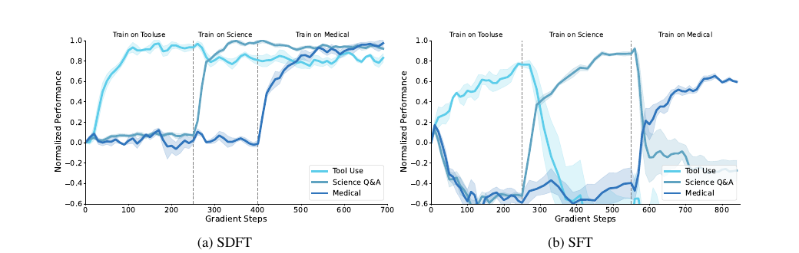

<!-- _class: lead -->
# Self-Distillation Enables Continual Learning

SDFT: Self-Distillation Fine-Tuning

---
# この論文の要点

- SFTの課題: off-policy学習で忘却が起きやすい
- 提案: **SDFT**（Self-Distillation Fine-Tuning）
- 同一モデルを2役で利用
  - student: $\pi_\theta(\cdot|x)$
  - teacher: $\pi(\cdot|x,c)$（demonstration付き）
- studentのon-policy rollout上で reverse KL を最小化

---
# 問題設定: 継続学習で何が難しいか

- SFTはoff-policy imitation
  - 学習時と推論時の状態分布がずれやすい
  - 継続学習で忘却を起こしやすい
- RLはon-policy化できるが、報酬関数が必要
- 実務では「demonstrationはあるが報酬はない」場面が多い

---
# SDFTの基本設計

- student: $\pi_\theta(\cdot\mid x)$
- teacher: $\pi(\cdot\mid x,c)$
  - $c$: 入力 $x$ に対応するexpert demonstration
- student rollout $y\sim\pi_\theta(\cdot\mid x)$ 上で
  reverse KLを最小化

$$
L(\theta)=D_{KL}(\pi_\theta(\cdot|x)\|\pi(\cdot|x,c))
$$

---
<!-- _class: media-bottom -->
# 手法イメージ（Figure 2）

- demonstration条件付きteacherを使って
- student自身の軌跡に対して密なtoken-level信号を返す
- reward設計なしでon-policy更新を実現

  

---
# 実験設定

- 主モデル: Qwen2.5-7B-Instruct
- 2設定で評価
  - Skill Learning: Science Q&A / Tool Use / Medical
  - Knowledge Acquisition: 2025年自然災害Wikipedia（約200K tokens）
- 既存能力の保持も評価
  - HellaSwag, TruthfulQA, MMLU, IFEval, Winogrande, HumanEval

---
<!-- _class: media-bottom -->
# Skill Learningの結果

- Science Q&A / Tool Use / Medical を順番に学習する設定で評価
- Figure 3では、SDFTは前タスクを維持しながら次タスクを積み上げる
- 一方SFTは、新しいタスクを学ぶたびに先行タスクが崩れる
- Science Q&A のスケーリングでは
  - 3BではSFT未満
  - 7BでSFT比 +4pt、14Bで +6.9pt

  

---
# Table 1: Knowledge Acquisition

- 2025年の自然災害Wikipediaを追加知識として学習
- 学習後、その知識に答えられるかをQAで評価
- in-distribution だけでなく OOD な聞き方でも比較

| Method      | Strict | Lenient |  OOD |
| ----------- | -----: | ------: | ---: |
| Base        |      0 |       0 |    0 |
| Oracle RAG  |     91 |     100 |  100 |
| CPT         |      9 |      37 |    7 |
| SFT         |     80 |      95 |   80 |
| SDFT (Ours) |     89 |     100 |   98 |

- SDFTはSFTより in-distribution / OOD ともに改善
- Oracle RAGに近い精度まで到達

---
# Table 2: Reasoningモデルへのanswer-only学習

- reasoning model に answer-only データで追加学習
- 追加学習後の最終精度と生成トークン長を比較
- 性能だけでなく、reasoning挙動が壊れないかを見る

| Method                 | Accuracy | Avg. # of tokens |
| ---------------------- | -------: | ---------------: |
| Olmo-3-7B-Think (Base) |     31.2 |             4612 |
| + SFT                  |     23.5 |             3273 |
| + SDFT (Ours)          |     43.7 |             4180 |

- SFTは精度・生成長ともに低下
- SDFTは精度改善し、reasoning挙動の崩れを抑制

---
# ここまでの読み取り

- Skill Learningでは、複数タスクを順次学んでも崩れにくい
- Knowledge Acquisitionでは、OODな質問形式にも強い
- Reasoning modelでも、answer-only学習で挙動を壊しにくい

---
# 関連研究との位置づけ

- DAgger (on-policy imitation): Ross et al., 2011
- LwF / EWC (continual learning)
- Context distillation (Bai et al., 2022)

SDFTはこれらを「ICLでteacher化した同一モデル蒸留」に接続した実装的アプローチ。

---
# 限界と運用上の注意

- モデルサイズ依存
  - 小規模モデルではICL不足でteacher品質が弱い
- 計算コスト増
  - SFT比で約2.5x FLOPs / 約4x wall-clock
- 文体アーティファクト
  - teacher由来フレーズをstudentが継承する場合あり
- 大きな行動様式変換（non-reasoning -> reasoning）は苦手

---
<!-- _class: lead -->
# 理論的な解釈

IRLとの関係を最後に整理する

---
# trust-region RL

論文の出発点は trust-region regularized RL:

$$
\pi_{k+1}=\arg\max_{\pi}\;\mathbb{E}_{y\sim\pi}[r(y,x)]-\beta D_{KL}(\pi(\cdot|x)\|\pi_k(\cdot|x))
$$

この最適解はtilted distributionで書ける:

$$
\pi^*_{k+1}(y|x)\propto\pi_k(y|x)\exp(r(y,x)/\beta)
$$

---
# 報酬の逆算

上式を並べ替えると、最適方策と現方策の比で報酬を表せる:

$$
r(y,x)=\beta\left[\log\pi^*_{k+1}(y|x)-\log\pi_k(y|x)\right]+C
$$

通常IRLでは $\pi^*_{k+1}$ が未知なので、
ここをどう近似するかが難しい。

---
# In-Context Assumption

SDFTのキー仮定:

$$
\pi^*_{k+1}(y|x)\approx\pi(y|x,c)
$$

- demonstrationを見た同一モデルの条件付き方策が
  「次ステップの望ましい方策」を近似するとみなす
- これにより暗黙報酬を定義できる:

$$
r(y,x,c)=\log\pi(y|x,c)-\log\pi_k(y|x)
$$

---
# reverse KLとの同値性

自己回帰分解でtoken-level rewardへ展開すると、
policy gradientは期待値でreverse KL目的に一致する。

直感:
- teacherが「demonstration付きで見たときの望ましい分布」
- studentが「現在の自分の分布」
- そのlog-ratioを報酬と見た更新が、SDFTの蒸留損失と整合

=> **SDFTは reward-free だが IRL的なon-policy更新として読める**

---
# SDFTは何を置き換えるのか

- 置き換え対象: 「demonstrationからのoff-policy SFT」
- 置き換えないもの: rewardありのon-policy RLそのもの
- 補完関係:
  - SDFTで初期方策を改善
  - その後にRLで報酬最適化

論文でも「RL前段として自然に組み合わせ可能」と議論されている。

---
<!-- _class: lead -->
# まとめ

- SDFTは「demonstrationしかない」場面で使えるon-policy学習
- 実験上は、忘却を抑えながら新タスクを伸ばせる点が主価値
- 理論面では、IRLの構図をICL teacherで実装可能化した方法と読める
