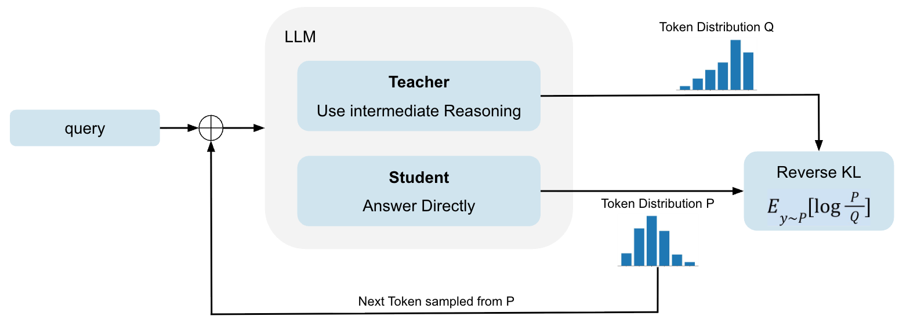
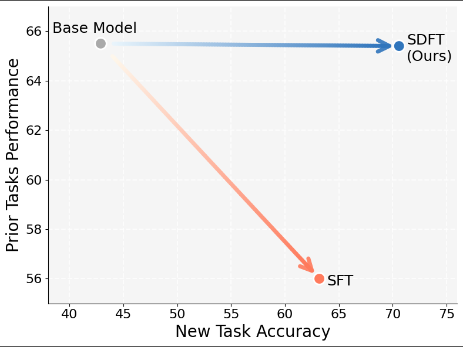

# idea
<!-- 文章にする前の気づき、input情報など雑記.あまり変更しない -->

- 最近自分の中で熱い on-policy self-distilationの論文の１つとして読む
  - https://arxiv.org/html/2601.19897v1

- 面白ポイント
  - 継続学習の観点でタイトルをつけているがOPSDに関する色々な示唆が得られる
    - reference Answerを入力データとするOPSDはIRLにと考えることができることをことを示していて、これは自分も同意
      - かつてのGAILなどの模倣学習が Behavior　Cloningと比べて良かった点について、SFTとOPSDとの対比として考えることができる
    - 知識獲得のためのFinetuningを試していて、良い結果が得られている
      - この分野について詳しくないが、かなりいい性能が出ているように見える。
        - （先行研究でもっと良いものがあるかもしれないのでそれは要調査
  - タイトルにあるような継続学習観点でのOPSDのメリットが実験で示されている
  - limitation

- GRPOとの比較はなし
    - Discussionにあった
        - RLとそもそも組み合わせることができる
        - entropyは下がらないので、 RLの前段階として使える
        - （実際RLVRの報酬と組み合わせても良いのでは？？）
        - この辺りはfuture workとのこと
- Qwen2.5と古めのモデル
    - Reasoning Modelでも使える？
        - non-reasoningデータからOLMO thinkを学習してmedicalドメインの性能向上を実現できたと記載されている
- BaseModelからいきなりこれをしたらどうなる？
    
    - SFTの代替になるなら良い

その他注目ポイント
- モデルサイズが大きいほどICL能力が高く結果として良いteacherとして動作する

# Draft
<!-- ユーザーによる文章案のscrachpad.あまり変更しない -->

# for AI Draft
<!-- AI向けの取材用scratchpad draft, idea以外に調査したり、ユーザーに深掘り質問した内容を記載質問した内容を記載 -->

- paper title: Self-Distillation Enables Continual Learning
- url: https://arxiv.org/abs/2601.19897
- 著者: Idan Shenfeld, Mehul Damani, Jonas Hubotter, Pulkit Agrawal
- 投稿日: 2026-01-27 (v1)
- 公式コード/データセット: http://idanshenfeld.com/SDFT

## この論文の主張（1行）

SFTのようなoff-policy学習では継続学習で忘却が起きやすいが、デモ付き条件化モデルを教師にしたon-policy自己蒸留（SDFT）なら、新タスクを伸ばしつつ既存能力の劣化を抑えられる。

## 手法メモ（事実）

- 手法名: SDFT (Self-Distillation Fine-Tuning)
- student: `πθ(·|x)`（問題だけ）
- teacher: `π(·|x,c)`（問題 + 実演デモ `c`）
- 学習: student自身のrollout上で `DKL(πθ(·|x) || π(·|x,c))` のreverse KLを最小化
- 位置づけ:
  - demonstrationからrewardを明示推定せずにon-policy更新を行う
  - 論文中ではIRL風の解釈（暗黙reward）を導出
- 実装メモ:
  - teacher重みは固定teacherではなく、基本はstudentのEMAを使う設定

## 実験設定メモ（事実）

- base model: 主に Qwen2.5-7B-Instruct
- 2つの設定:
  - Skill Learning
    - Science Q&A (SciKnowEval Chemistry L-3)
    - Tool Use (ToolAlpaca)
    - Medical (HuatuoGPT-o1 pipeline由来)
  - Knowledge Acquisition
    - 2025年の自然災害Wikipedia記事（知識カットオフ後）約200K tokens
    - QAを生成して学習/評価
- 評価軸:
  - 新タスク精度
  - 既存能力（HellaSwag, TruthfulQA, MMLU, IFEval, Winogrande, HumanEvalの平均）
  - Knowledge AcquisitionではOOD質問精度も追加

## 主要結果メモ（数字）

- Knowledge Acquisition（Table 1）
  - Strict Accuracy: CPT 9 / SFT 80 / SDFT 89
  - OOD Accuracy: CPT 7 / SFT 80 / SDFT 98
  - Oracle RAG: Strict 91, OOD 100（上限目安）
- Reasoning modelへのanswer-only学習（Table 2, Olmo-3-7B-Think）
  - Base: 31.2%
  - +SFT: 23.5%（悪化）
  - +SDFT: 43.7%（改善）
  - 平均生成トークン: Base 4612 / SFT 3273 / SDFT 4180
- 逐次3タスク学習（Figure 3）
  - SDFTは先行タスク維持しながら次タスクを伸ばす
  - SFTは次タスク学習時に過去タスクが崩れる挙動
- スケーリング（Figure 5左）
  - 3BではSFT未満
  - 7BでSFT比 +4pt、14Bで +6.9pt（Science Q&A）
- 計算コスト（Discussion）
  - SFT比で約2.5x FLOPs、約4x wall-clock

## 制約・limitationメモ（事実）

- 小規模モデルだとICL能力不足でteacher品質が弱い
- 「Based on the text...」のようなteacher由来言い回しをstudentが引き継ぐアーティファクト
  - 先頭数tokenのloss maskingで緩和（ただしヒューリスティック）
- 非reasoningモデルをreasoningモデル化するような大きな行動変化は苦手

## 重要な関連研究（URL付き）

- DAgger / on-policy imitation learning:
  - Ross et al., 2011, AISTATS
  - https://proceedings.mlr.press/v15/ross11a.html
- Continual Learningの古典:
  - Learning without Forgetting (Li & Hoiem, 2016)
  - https://arxiv.org/abs/1606.09282
  - EWC (Kirkpatrick et al., 2017)
  - https://arxiv.org/abs/1612.00796
- Context Distillation系:
  - Bai et al., Constitutional AI (context distillationを含む)
  - https://arxiv.org/abs/2212.08073
- 近接するon-policy self-distillationのLLM論文:
  - Self-Distilled Reasoner: On-Policy Self-Distillation for LLMs
  - https://arxiv.org/abs/2601.18734

# Main
<!-- 記事本文。この記事を書くプラットフォーム向けにローカライズするため、やや冗長さは情報は削りすぎずない良い文章を目指す -->

この記事は、論文「Self-Distillation Enables Continual Learning」（arXiv:2601.19897）を読んで、SDFTの要点と、特に「なぜ継続学習で効くのか」を中心に整理したメモです。  
論文URL: https://arxiv.org/abs/2601.19897

## 先に要点

この論文のコアはかなりシンプルで、SFTのようなoff-policy学習を、demonstrationを使ったon-policy学習に置き換える、という話です。  
具体的には、同じモデルを2つの役割で使います。studentは通常どおり入力`x`だけを見る。teacherは`x`に加えて実演デモ`c`も見る。学習はstudent自身のrollout上で、teacherとstudentの分布のズレ（reverse KL）を詰める。これだけです。

この設計の嬉しさは、報酬関数を明示設計しなくてもon-policy更新ができることです。論文ではこれをIRLに近い見方で説明していて、個人的にも腑に落ちました。rewardを直接推定する代わりに、「デモを見た同一モデル」を教師化して、その分布差を密な学習信号として使う、という立て付けです。

## 何が新しいのか

「デモから学ぶ」自体は珍しくありません。多くはSFTで、固定データをなぞるoff-policy学習です。問題は、推論時にはモデル自身の生成prefixに条件付くので、学習時に見た状態分布とズレることです。これが継続学習では忘却や劣化に直結しやすい。

SDFTはここを、studentの軌跡上でteacher信号を返す形に変えます。つまり「今の自分が実際に踏む状態」で学ぶので、distribution mismatchを減らせる。論文の主張はこの一点にかなり収束しています。

## 実験の見どころ

実験は大きく2系統です。1つは新しいスキルの獲得（Skill Learning）。もう1つは新しい知識の注入（Knowledge Acquisition）です。前者はScience Q&A / Tool Use / Medical、後者は2025年自然災害のWikipediaコーパス（約200K tokens）で検証しています。

読みながら特に良かったのは、単に新タスク精度だけではなく、既存能力の維持を明示的に評価していることです。HellaSwagやMMLUなどの平均を「忘却」指標にしているので、継続学習の主張と評価が噛み合っています。

### Knowledge Acquisitionの数字はかなり強い

Table 1で、Strict AccuracyはSFT 80に対してSDFT 89、OOD AccuracyはSFT 80に対してSDFT 98でした。  
Oracle RAGがStrict 91/OOD 100なので、SDFTは「注入知識を内部化してOOD質問にも効く」方向にかなり寄っています。ここは単なる丸暗記との差が出ていて面白いです。

| Method      | Strict Accuracy | Lenient Accuracy | OOD Accuracy |
| ----------- | --------------: | ---------------: | -----------: |
| Base        |               0 |                0 |            0 |
| Oracle RAG  |              91 |              100 |          100 |
| CPT         |               9 |               37 |            7 |
| SFT         |              80 |               95 |           80 |
| SDFT (Ours) |              89 |              100 |           98 |

### 継続学習としての挙動

3タスクを順番に学習する実験（Figure 3）では、SDFTはタスクを積み上げる形で推移し、SFTは次タスクで前タスクが落ちる典型的な干渉を示しています。  
また単一タスク学習でも、SDFTは新タスクを伸ばしながら既存能力の劣化を抑える、というPareto的に良い位置に乗っています。

### 「reasoningデータなし」でreasoningモデルを壊しにくい

Olmo-3-7B-Thinkに対して、answer-onlyの医療データで学習した実験（Table 2）も重要でした。  
SFTは31.2%→23.5%に悪化し、平均生成トークンも短くなっています。一方SDFTは43.7%まで改善し、生成長も比較的維持しています。  
この結果は、短い最終回答だけで直接SFTすると思考スタイルが潰れる、という実務上の違和感と整合的です。

| Method                 | Accuracy | Avg. # of tokens |
| ---------------------- | -------: | ---------------: |
| Olmo-3-7B-Think (Base) |     31.2 |             4612 |
| + SFT                  |     23.5 |             3273 |
| + SDFT (Ours)          |     43.7 |             4180 |

## limitationと運用上の注意

万能ではなく、限界も比較的はっきり書かれています。まずモデルサイズ依存が強く、3BではSFTに負ける一方、7B/14Bでは有利になります。teacherの質がICL能力に依存する以上、これは自然な結果です。

次に、計算コストはSFTより重いです。論文ではSFT比で約2.5x FLOPs、約4x wall-clockと報告されています。単段で完結するメリットはあるものの、実運用ではこのコストと忘却耐性のトレードオフを見積もる必要があります。

さらに、teacher由来の文体アーティファクト（「Based on the text...」など）をstudentが拾う問題もあります。先頭トークンのloss maskingで軽減できるとされていますが、これはヒューリスティックなので、まだ改善余地が大きい領域です。

## 関連研究との位置づけ

この論文は、個人的には次の3本の線の交点に見えます。  
1つ目はDAgger系のon-policy imitation learningの線。2つ目はLwF/EWCに代表される忘却抑制の線。3つ目はcontext distillationの線です。  
SDFTはそれらを「LLMのICLをteacher化する」という実装可能な形にまとめ直した、という見方がしっくりきます。

重要な関連研究URLだけ置いておきます。

- DAgger (Ross et al., 2011): https://proceedings.mlr.press/v15/ross11a.html
- Learning without Forgetting (Li & Hoiem, 2016): https://arxiv.org/abs/1606.09282
- EWC (Kirkpatrick et al., 2017): https://arxiv.org/abs/1612.00796
- Constitutional AI / context distillation (Bai et al., 2022): https://arxiv.org/abs/2212.08073
- 近接研究 OPSD (2026): https://arxiv.org/abs/2601.18734

## まとめ

SDFTは「デモしかないがon-policyで学びたい」という、実務で頻出する中間地帯にうまく刺さる手法でした。  
特に、知識注入でのOOD改善と、reasoningモデルをanswer-onlyデータで壊しにくい点は、単なる理論的面白さを超えて実践価値があると感じます。

一方で、コスト増とモデルサイズ依存は現実的な制約です。短期的には、SFTの代替というより「SFTの次段」または「RL前の初期化」として導入し、忘却耐性と性能の差分をタスクごとに測る運用が良さそうです。

# title options
- Self-Distillation Enables Continual Learning 読書メモ: SDFTはなぜ忘却を抑えられるのか
- SDFT論文メモ: demonstrationからon-policy学習して継続学習を成立させる
- SFTで壊れるreasoningをどう守るか: SDFTの実験結果と実務での見どころ
- 継続学習としてのon-policy自己蒸留: Self-Distillation Enables Continual Learning を読む
- デモ学習の次の一手: SDFT（Self-Distillation Fine-Tuning）の要点整理
